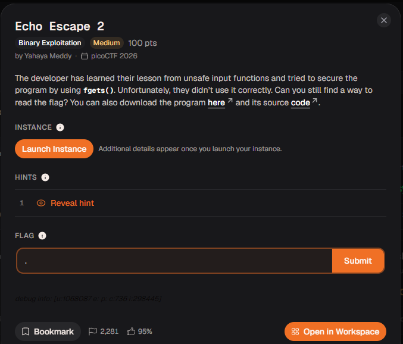
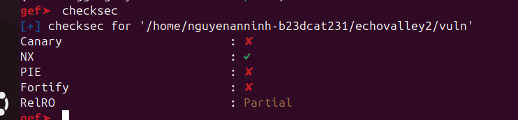
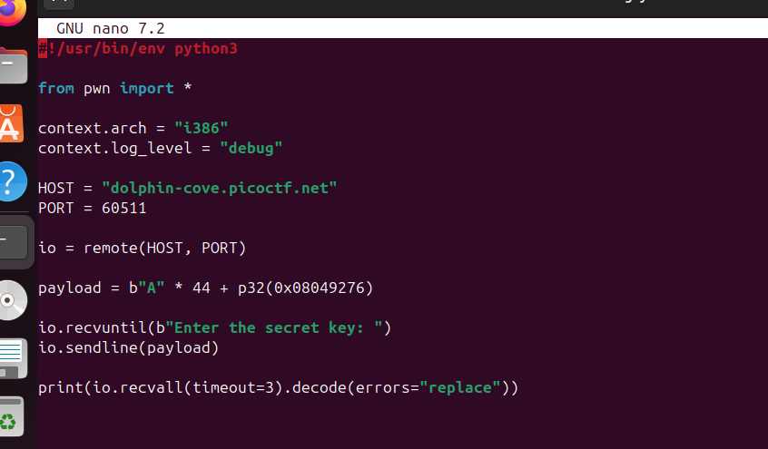
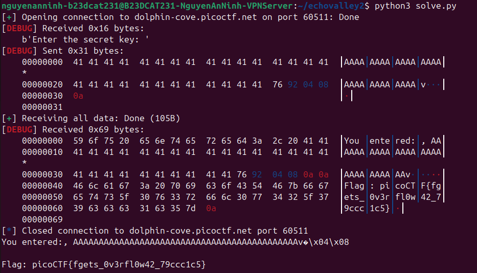

đây là mã nguồn chương trình
#include <stdio.h>
#include <stdlib.h>
#include <string.h>

void win() {
    FILE *fp = fopen("flag.txt", "r");
    if (!fp) {
        perror("[!] Could not open flag.txt");
        exit(1);
    }

    char flag[128];
    fgets(flag, sizeof(flag), fp);
    printf("Flag: %s\n", flag);
    fflush(stdout);
    fclose(fp);
}

void vuln() {
    char buf[32];  

    printf("Enter the secret key: ");
    fflush(stdout);

    fgets(buf, 128, stdin);

    printf("You entered:, %s\n", buf);
}

int main() {
    vuln();
    puts("Goodbye!");
    return 0;
}

offset tôi tìm được là 44
địa chỉ hàm win là 0x8049276 (PIE tắt)

