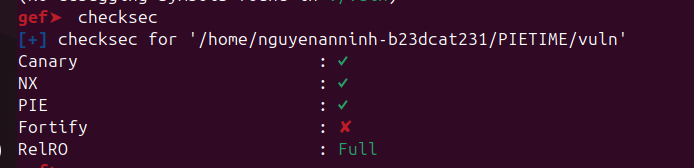
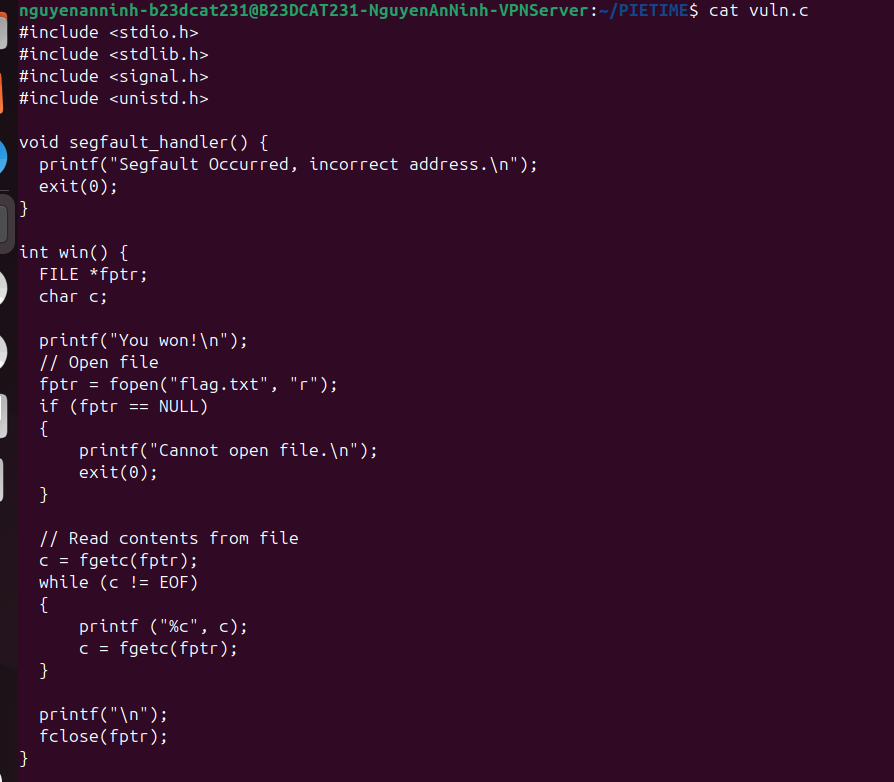
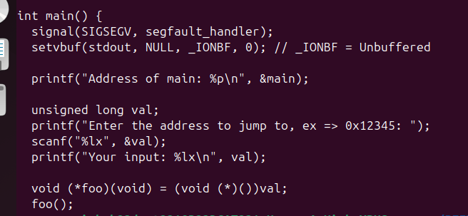
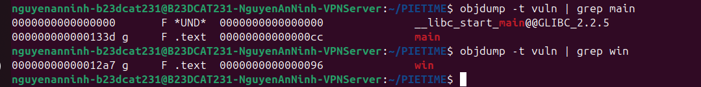
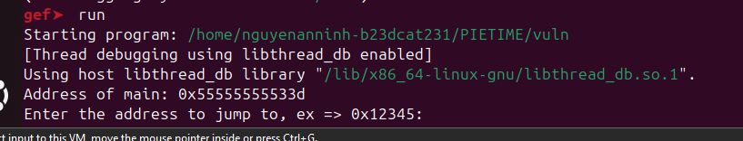
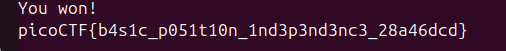

# Writeup: PIETIME (PicoCTF)

## 1. Phân tích cơ chế bảo vệ (checksec)
Dựa vào hình ảnh `checksec`, ta thấy:
- **PIE (Position Independent Executable):** Được bật. Điều này có nghĩa là địa chỉ bộ nhớ (base address) của chương trình sẽ thay đổi ngẫu nhiên mỗi lần chạy.
- Các cơ chế bảo vệ khác như NX, Canary cũng được bật, tuy nhiên với dạng bài này chúng ta không cần quan tâm nhiều đến chúng.

## 2. Phân tích mã nguồn
Chương trình có 2 hàm chính đáng chú ý:

1. **Hàm `win()`:** Hàm này có chức năng đọc file `flag.txt` và in ra cờ (flag). Mục tiêu của chúng ta là phải tìm cách gọi được hàm này.
2. **Hàm `main()`:**
   - Đầu tiên, chương trình in ra địa chỉ thực tế của hàm `main` khi chương trình đang chạy: `printf("Address of main: %p\n", &main);`
   - Sau đó, chương trình yêu cầu người dùng nhập vào một địa chỉ hex: `scanf("%lx", &val);`
   - Cuối cùng, chương trình sẽ ép kiểu giá trị mà người dùng nhập vào thành một con trỏ hàm và thực thi (nhảy đến địa chỉ đó): `void (*foo)(void) = (void (*)())val; foo();`.

Vì chương trình cho phép chúng ta thực thi bất kỳ địa chỉ nào ta muốn, chúng ta chỉ cần cung cấp cho nó địa chỉ của hàm `win()`. Tuy nhiên, vì **PIE** được bật, địa chỉ của hàm `win()` sẽ không cố định mà thay đổi ở mỗi lần chạy.

## 3. Ý tưởng khai thác
Mặc dù PIE làm thay đổi địa chỉ base của chương trình mỗi lần chạy, nhưng **khoảng cách (offset) giữa các hàm bên trong chương trình luôn luôn cố định**.

Dựa vào kết quả của lệnh `objdump` để lấy offset của các hàm trong file thực thi:
- Offset của hàm `main` là: `0x133d`
- Offset của hàm `win` là: `0x12a7`

Khoảng cách (độ chênh lệch) giữa `main` và `win` là: 
`0x133d - 0x12a7 = 0x96`

Trong hàm `main`, chương trình đã chủ động leak (tiết lộ) địa chỉ thực tế của hàm `main` khi đang chạy. Do đó, ta có thể tính được địa chỉ của hàm `win` lúc runtime bằng công thức:

**`Địa chỉ win = Địa chỉ main (leak) - 0x96`**

*Hoặc một cách tính khác:*
1. `Base Address = Địa chỉ main (leak) - 0x133d`
2. `Địa chỉ win = Base Address + 0x12a7`

**Thực hành trên ví dụ:**
Khi chạy thử chương trình (như trong ảnh GDB), chương trình in ra địa chỉ của `main` là `0x55555555533d`.
Ta có thể tính ngay địa chỉ của `win` là: `0x55555555533d - 0x96 = 0x5555555552a7`.

Tiếp theo, ta chỉ cần nhập giá trị `5555555552a7` vào chương trình.

## 4. Kết quả
Sau khi nhập địa chỉ hàm `win()` đã tính toán vào, chương trình sẽ nhảy thẳng đến hàm `win()` và in ra flag cho chúng ta:

**Flag:** `picoCTF{b4s1c_p051t10n_1nd3p3nd3nc3_28a46dcd}`

